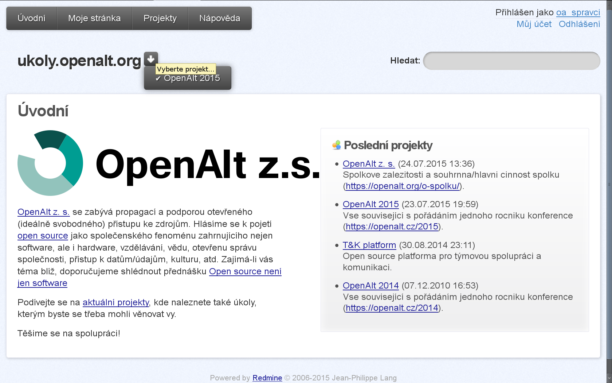
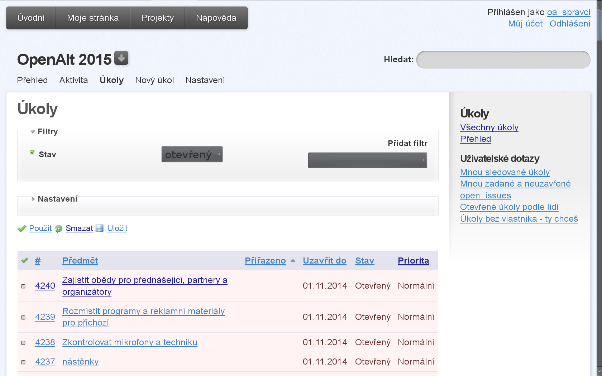
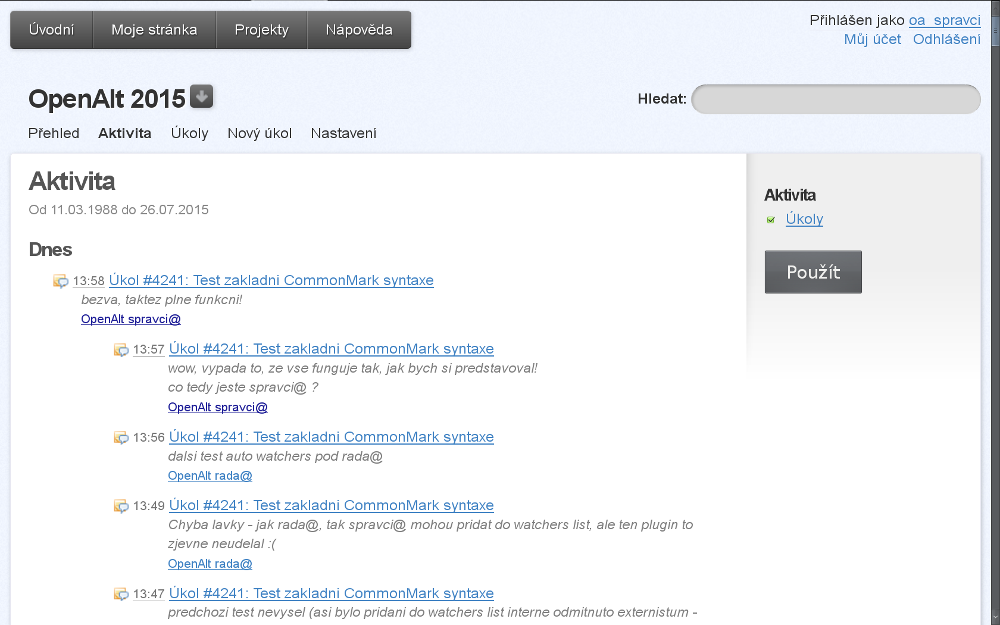
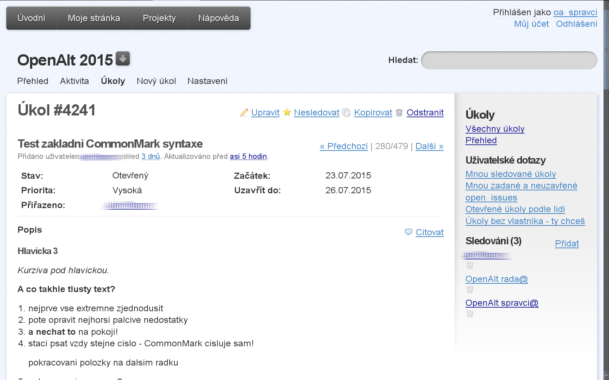

# OpenAlt z. s. project tracking system

Currently a slightly modified Redmine instance is used. The goal is to have as minimal and clean-looking system as possible.

### Steps to reproduce the Redmine setup:

1. setup SQL DB
1. [install current Redmine 3.x](http://www.redmine.org/projects/redmine/wiki/redmineinstall) and setup the SQL DB backend (FIXME: how to migrate existing Redmine DB?)
1. install Redmine plugins `redmine_auto_watchers` `redmine_drafts` and theme `redmine-pepper-theme`

    ~~~~sh
RM_INS='/usr/local/lib/redmine'
cd "$RM_INS"/plugins/ && git clone --depth 1 https://github.com/thegcat/redmine_auto_watchers
cd "$RM_INS"/plugins/ && git clone --depth 1 https://github.com/jbbarth/redmine_drafts.git
# plugins require "migration"
cd "$RM_INS" && rake redmine:plugins:migrate RAILS_ENV=production
# themes require only web server restart
cd "$RM_INS"/public/themes/ && git clone --depth 1 https://github.com/koppen/redmine-pepper-theme.git

# make the text field visible (without clicking on the tiny icon and with more lines of text shown)
cp ~/redmine_setup_howto/app/views/issues/_form.html.erb "$RM_INS"/app/views/issues/
# change subjects of all emails to "#ID Issue full name", exchange the issue description for the change diff
cp ~/redmine_setup_howto/app/models/mailer.rb "$RM_INS"/app/models/
# make the dotted line in history being above each of the records, not below
cp ~/redmine_setup_howto/public/stylesheets/application.css "$RM_INS"/public/stylesheets/

/etc/init.d/apache2 restart  # or nginx restart
~~~~

1. in Redmine Administration

    * set the default theme to "redmine-pepper-theme"
    * have only one queue (Issues)
    * only two issue states (Open/Closed)
    * two roles (Worker, Project Manager)
    * permissions for everything (except for creating/deleting top-level projects in case of "Worker" and except for "Create private notes" for anyone)
    * make as few fields visible as possible (e.g. no queue, no category, no version, etc.)
    * default columns in project issues list: issue numerical id, issue name, assignee, date of completion, state, priority
    * text syntax "Redmine Markdown"

### TODO

* find commonmark/markdown edit live preview module
* make the empty vertical space between the top bar and search bar much smaller
* remove the huge issue type (e.g. "Issue") + id (e.g. " #3494") from the page and add the id to the issue name instead
* remove user queries (they remained in the DB after some plugin)

### Maintenance

* uninstall plugins

    ~~~~sh
cd /usr/local/lib/redmine/
rake redmine:plugins:migrate NAME=plugin_name VERSION=0 RAILS_ENV=production
rm -r plugins/plugin_name/
/etc/init.d/apache2 restart  # or nginx restart
~~~~

### Usage

* do NOT use "URL" field in project settings (it looks ugly on the project dashboard) and use the description text field instead
